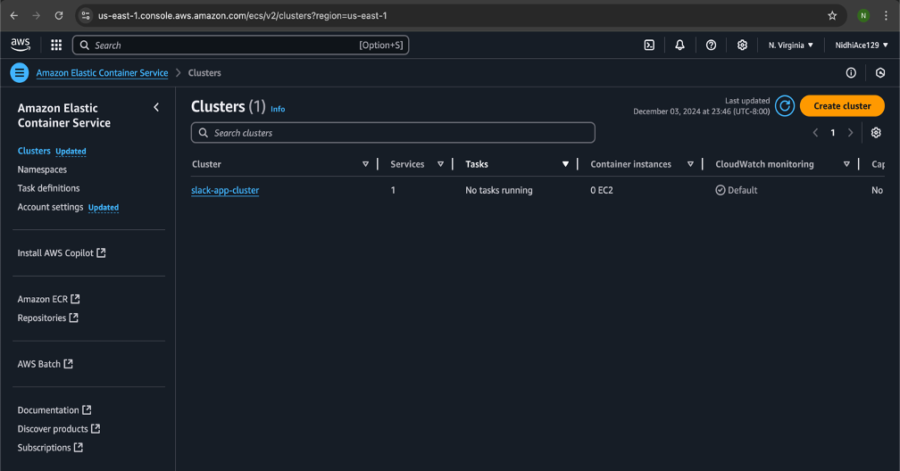

# SlackCloudApp
Final project for Cloud Course which is deployed on AWS with Terraform and impersonates texting app Slack

Final Design Implementation

Architecture Diagram:

Terraform code application:
 

Components:

1.	VPC
 

2.	ELB

3.	ECS

 

 

4.	S3

 
5.	RDS
 

 

6.	CloudWatch
 

